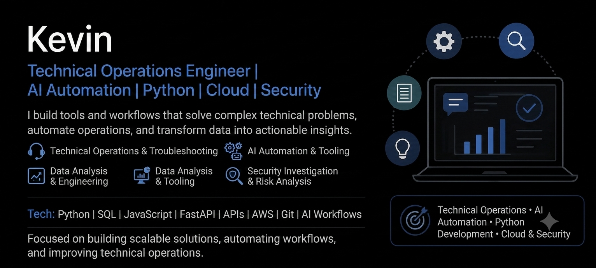

<h2 align="center">Technical Support Engineer @ MetaMask | Blockchain Investigations & Security | Automation (Python)</h2>

  
  
  

---

## About Me

I am a Technical Operations Engineer focused on automation, AI-assisted workflows, technical troubleshooting, security analysis, and data-driven process improvement.

With 4+ years of experience supporting complex software platforms, I specialize in investigating technical issues, analyzing system behavior, building internal tools, and creating workflows that help teams operate more efficiently.

My background includes developer support, blockchain technology, customer-facing engineering, Python automation, SQL analysis, and AI-powered tooling.

- Technical Operations Engineer with experience in escalations, automation, security investigations, and operational tooling
- Strong focus on root-cause analysis, workflow improvement, and solving complex technical problems
- Experienced building internal tools, analyzing data, and improving operational processes
- Daily user of AI tools for research, automation, documentation, and workflow optimization
- Background in Python, JavaScript, SQL, APIs, blockchain technology, and customer-facing engineering
- Fun fact: Top 10 score worldwide on *Galaga*

---

## Featured Projects

> Some projects below are documentation-only summaries of internal tools created during professional experience. Source code, customer data, screenshots, logs, and proprietary implementation details are not public.

| Project | Focus | Description |
|---|---|---|
| [Boots Console Logs Explorer](https://github.com/kji304dev/boots-console-logs-explorer) | Log Analysis / Support Triage | Documentation-only summary of an internal console log analysis workflow for parsing, organizing, and triaging browser and app logs during support investigations. |
| [iBuddy](https://github.com/kji304dev/ibuddy-support-analytics) | Support Analytics / Reporting | Support analytics workflow that extracts, organizes, and analyzes support conversations to identify trends, recurring issues, and operational insights. |
| [StarScoop](https://github.com/kji304dev/starscoop-review-triage) | Review Triage / Data Cleanup | Tool that cleans, deduplicates, categorizes, and summarizes app review feedback by platform, language, severity, and issue pattern. |
| [Support Runbook Template](https://github.com/kji304dev/support-runbook-template) | Documentation / Knowledge Base | Reusable technical support runbook template for documenting symptoms, investigation steps, escalation paths, resolution notes, and follow-up actions. |
| [LogSentinel](https://github.com/kji304dev/logsentinel) | Monitoring / Investigation | Lightweight log monitoring concept for identifying suspicious or unusual activity patterns and supporting faster investigation. |
| [PhishLens](https://github.com/kji304dev/phishlens) | Security Support / URL Triage | URL triage concept that evaluates suspicious links and produces explainable risk signals for security-focused support workflows. |

---

## Tech & Tools

  
  
  
  
  
  
  
  
  
  
  

### Technical Operations & Engineering

- Technical troubleshooting and root-cause analysis
- Escalated issue investigation
- Security-focused investigation and risk analysis
- API troubleshooting and integration support
- Python automation and internal tooling
- Data analysis and operational reporting
- AI workflow design and optimization
- Technical documentation and knowledge systems

---

## What I’m Building Toward

I am focused on building practical systems that combine automation, AI, cloud technologies, and data analysis to improve technical operations.

My goal is to create solutions that reduce manual work, improve decision-making, and help teams operate more efficiently through better tooling and intelligent workflows.

---

## Currently Learning

- AWS Solutions Architect Associate
- Cloud infrastructure fundamentals
- AI agent workflows
- Data engineering concepts
- Modern automation patterns

---

## Certifications / Background

- B.S. Computer Science
- Associate of Science
- Full Stack Developer Certificate
- Blockchain Developer Certificate
- Certified Blockchain Engineer

---

## What I’m Building Toward

I am focused on helping teams resolve complex technical issues faster through better troubleshooting workflows, clearer documentation, smarter support tooling, and practical use of AI-assisted analysis. My strongest areas are support engineering, customer-facing technical communication, technical documentation, reporting workflows, and support automation.

---

## Get in Touch

  
  

