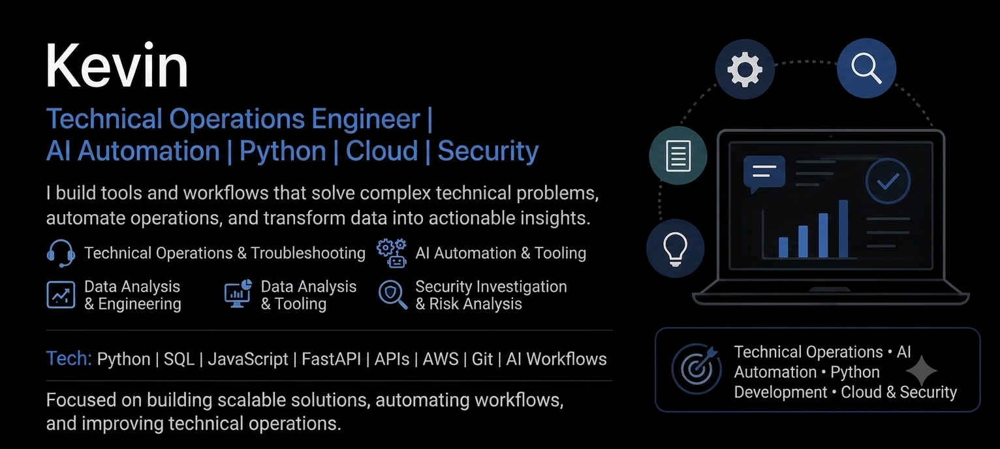

<h2 align="center">Technical Operations Engineer | Python Automation | Cloud | AI | Former Consensys (MetaMask)</h2>

  
  
  

---

## About Me

I am a Technical Operations Engineer and software builder focused on solving operational problems through automation, data analysis, cloud technologies, and practical software tools.

My background combines technical support engineering, software development, security investigations, blockchain infrastructure, APIs, and operational automation. At Consensys, I supported MetaMask users and systems, investigated complex wallet and transaction issues, performed security-focused investigations, and built internal tools to improve support workflows and analysis.

Today, I am expanding that experience into cloud operations, Python automation, data engineering, and AI-assisted systems.

- Technical troubleshooting, escalations, and root-cause analysis
- Python automation and backend development
- REST APIs, data validation, transformation, and analysis
- Security investigations and blockchain transaction analysis
- Operational tooling and workflow automation
- AI-assisted development and process improvement
- Technical documentation and support engineering
- B.S. in Computer Science
- Fun fact: Top 10 score worldwide on *Galaga*

---

# Featured Project

## Axiom Data Infrastructure (ADI)

**Data quality infrastructure for analyzing, validating, transforming, and auditing operational data.**

[View the ADI Repository →](https://github.com/kji304dev/axiom-data-infrastructure)

ADI is a full-stack data quality and validation platform designed to turn messy operational data into structured, explainable results.

Rather than simply reporting whether a file is valid, ADI analyzes data quality, identifies problematic fields and records, calculates health metrics, and produces structured artifacts that can be used by people or downstream systems.

### What ADI Does

- Analyzes CSV and JSON datasets
- Detects missing, malformed, and inconsistent data
- Identifies problematic fields and records
- Calculates dataset health scores and quality grades
- Produces clean vs. dirty summaries
- Generates structured JSON analysis artifacts
- Maintains analysis run history
- Provides transformation and auditing workflows
- Exposes functionality through a REST API
- Includes a web interface for interactive analysis

### Architecture

**Backend:** Python · FastAPI · Pydantic  
**Frontend:** React · JavaScript  
**Data:** CSV · JSON · Schema Validation  
**Infrastructure:** REST APIs · Render · Git/GitHub

ADI demonstrates the intersection of **software engineering, data engineering, technical operations, and automation** — building systems that identify operational problems and turn them into actionable information.

---

## Other Projects

> Some projects below are documentation-only summaries of internal tools created during professional experience. Source code, customer data, screenshots, logs, and proprietary implementation details are not public.

| Project | Focus | Description |
|---|---|---|
| [Boots Console Logs Explorer](https://github.com/kji304dev/boots-console-logs-explorer) | Log Analysis / Support Triage | Documentation-only summary of an internal console-log analysis workflow for parsing, organizing, and triaging browser and application logs during support investigations. |
| [iBuddy](https://github.com/kji304dev/ibuddy-support-analytics) | Support Analytics / Reporting | Support analytics workflow for organizing and analyzing support conversations to identify trends, recurring issues, and operational insights. |
| [StarScoop](https://github.com/kji304dev/starscoop-review-triage) | Review Triage / Data Cleanup | Tool for cleaning, deduplicating, categorizing, and summarizing application review feedback by platform, language, severity, and issue pattern. |
| [Support Runbook Template](https://github.com/kji304dev/support-runbook-template) | Documentation / Knowledge Systems | Reusable technical support runbook structure for symptoms, investigations, escalation paths, resolutions, and follow-up actions. |
| [LogSentinel](https://github.com/kji304dev/logsentinel) | Monitoring / Investigation | Lightweight monitoring concept for identifying unusual activity patterns and supporting technical investigations. |
| [PhishLens](https://github.com/kji304dev/phishlens) | Security / URL Triage | Security-focused URL triage concept that evaluates suspicious links and produces explainable risk signals. |

---

## Tech & Tools

  
  
  
  
  
  
  
  
  
  
  
  
  

### Technical Operations & Engineering

- Technical troubleshooting and root-cause analysis
- Escalated issue investigation
- Python automation and internal tooling
- API troubleshooting and integration support
- Data validation, transformation, and analysis
- Security-focused investigations
- Operational monitoring and reporting
- AI-assisted workflow design
- Technical documentation and knowledge systems

---

## What I’m Building Toward

I am focused on engineering roles at the intersection of **technical operations, cloud infrastructure, automation, and software development**.

I enjoy problems where software can eliminate repetitive work, improve observability, validate data, accelerate investigations, or make complex technical systems easier to operate.

My current focus is expanding my cloud engineering skills while continuing to build practical Python-based systems and automation tools.

---

## Currently Learning

- AWS Cloud & Solutions Architecture
- Cloud operations and infrastructure
- Python automation
- Data engineering patterns
- AI-assisted engineering workflows
- Monitoring and observability

---

## Certifications / Background

- B.S. Computer Science
- Associate of Science
- Certified Full Stack Developer
- Certified Blockchain Developer
- Certified Blockchain Engineer
- AutoCAD / CAD Certificate

---

## Get in Touch

I’m interested in remote opportunities involving **Technical Operations, Cloud Operations, Support Engineering, Automation, Developer Support, and technical problem-solving**.

  
  

